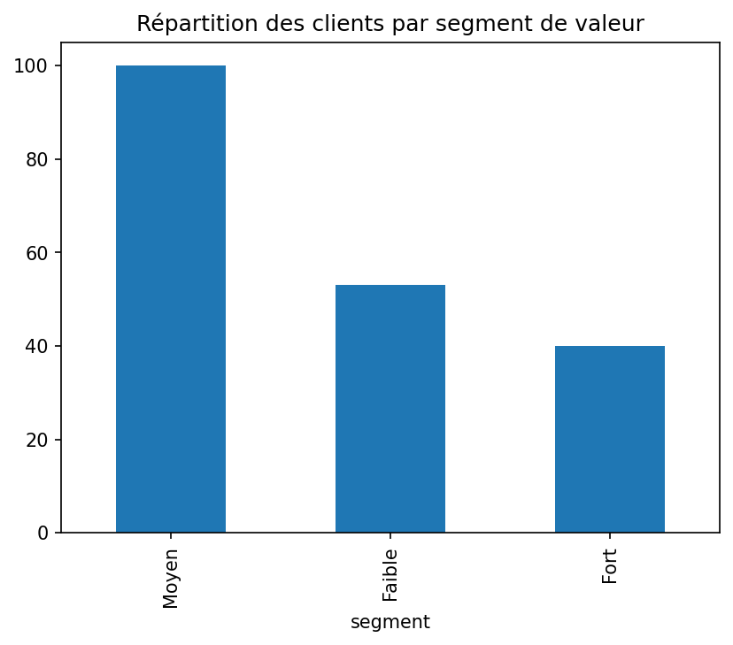

# Nettoyage et segmentation d'une base clients e-commerce

## Problème
Base clients brute de 206 lignes contenant des doublons et des valeurs
manquantes, rendant impossible tout calcul fiable de chiffre d'affaires
ou de segmentation client.

## Outils
Python, Pandas, Matplotlib, Jupyter Notebook.

## Processus
1. Diagnostic qualité (doublons, valeurs manquantes, incohérences de texte)
2. Nettoyage (suppression doublons, uniformisation du texte, imputation
   de l'âge par la médiane, conversion des dates)
3. Segmentation des clients par valeur (Faible / Moyen / Fort)
4. Identification des clients inactifs depuis plus de 300 jours

## Résultat
Après nettoyage, **74,0 % des clients sont inactifs depuis plus de 300 jours**, ce qui constitue une cible prioritaire pour une campagne de réactivation. La segmentation par valeur montre que **100 clients appartiennent au segment “Moyen”**, contre 53 dans le segment “Faible” et 40 dans le segment “Fort”, permettant de mieux orienter les actions marketing selon la valeur client.
